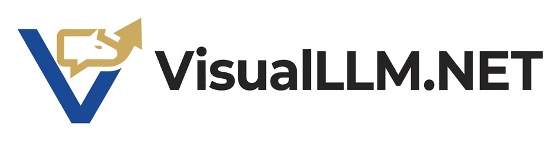

<p align="center">
  
</p>

<h1 align="center">VisualLLM.NET</h1>

<p align="center">
  <strong>Enterprise-Grade LLM Inference for the .NET Platform</strong>
</p>

<p align="center">
  <a href="#"></a>
  <a href="#"></a>
  <a href="#"></a>
  <a href="#"></a>
  <a href="LICENSE"></a>
</p>

---

**VisualLLM.NET** is an OpenAI-compatible inference server implemented in Visual Basic .NET, with an in-process native backend for GGUF-based local models.

> *"We didn't ask whether we should. We asked whether we could. And then we wrote the loader."*

## Why Visual Basic?

The AI infrastructure ecosystem has consolidated almost entirely around Python, a dynamically typed interpreted language from 1991 that remains convinced virtual environments are a character-building exercise.

We believe teams already invested in .NET should be allowed to run local inference without importing a parallel toolchain, three package managers, and a general tolerance for ambient breakage. Visual Basic .NET offers a different proposition:

- Deterministic readability. `Dim token As Integer` is not trying to be cool. It is trying to be legible at 3 AM.
- Operational conservatism. The language and runtime are boring in the productive sense of the word.
- Native interoperability. When the correct answer is "call the C library that already works," .NET is perfectly capable of doing that.
- Enterprise familiarity. Your logging, packaging, deployment, and auth story probably already speak .NET.

We are not being ironic. We are being operational.

## What Shipped In v0.1.0

- In-process `llama.cpp` inference through native P/Invoke bindings.
- OpenAI-compatible endpoints: `/`, `/healthz`, `/v1/models`, and `POST /v1/chat/completions`.
- Streaming chat completions over Server-Sent Events.
- Portable native runtime staging under `runtimes/<rid>/native`.
- Cross-platform build, package, and smoke-test scripts.
- GitHub Actions CI and tag-driven release packaging.
- SHA256 checksum files for release archives.

## Supported Runtimes

| Runtime | Status | Notes |
| --- | --- | --- |
| `win-x64` | Validated locally | Built, packaged, and smoke-tested against the published server with a real tiny GGUF model. |
| `linux-x64` | Automated | Wired into CI and release automation, but not manually smoke-tested locally before `v0.1.0`. |
| `osx-arm64` | Automated | Wired into CI and release automation, but not manually smoke-tested locally before `v0.1.0`. |

The honest caveat is the important part. Windows is the runtime validated by hand for this release. Linux and macOS are included in automation and should be treated accordingly until they have equivalent manual validation.

## Quick Start

### Binary Release

1. Download the archive for your runtime from Releases.
2. Download the matching `.sha256` file.
3. Verify the checksum.
4. Extract the archive.
5. Point the server at a GGUF model.
6. Start the server.
7. Send one chat completion request and act like this is normal.

### Verify The Archive

PowerShell:

```powershell
$expected = (Get-Content .\VisualLLM.NET-v0.1.0-win-x64.zip.sha256).Split(' ')[0]
$actual = (Get-FileHash .\VisualLLM.NET-v0.1.0-win-x64.zip -Algorithm SHA256).Hash.ToLowerInvariant()
$actual -eq $expected
```

Bash:

```bash
sha256sum -c VisualLLM.NET-v0.1.0-linux-x64.tar.gz.sha256
```

### Run The Server

Windows:

```powershell
Expand-Archive .\VisualLLM.NET-v0.1.0-win-x64.zip -DestinationPath .\VisualLLM.NET
cd .\VisualLLM.NET
$env:VISUALLLM_MODEL_PATH = 'C:\Models\TinyLlama-1.1B-Chat-v1.0.Q4_K_M.gguf'
.\VisualLLM.Server.exe --listen-port 5000 --gpu-layers 0
```

Linux or macOS:

```bash
tar -xzf VisualLLM.NET-v0.1.0-linux-x64.tar.gz -C ./VisualLLM.NET
cd ./VisualLLM.NET
export VISUALLLM_MODEL_PATH=/models/TinyLlama-1.1B-Chat-v1.0.Q4_K_M.gguf
dotnet ./VisualLLM.Server.dll --listen-port 5000 --gpu-layers 0
```

### Hit One Endpoint

```bash
curl http://127.0.0.1:5000/v1/chat/completions \
  -H "Content-Type: application/json" \
  -d '{
    "model": "default",
    "messages": [
      { "role": "user", "content": "Explain the operational advantages of Visual Basic in one sentence." }
    ],
    "stream": false,
    "temperature": 0
  }'
```

If you prefer environment variables over arguments, the server supports both. If you prefer YAML, this repository does not share that preference.

## Build From Source

```bash
git clone --recurse-submodules https://github.com/mattneel/VisualLLM.NET.git
cd VisualLLM.NET
dotnet restore VisualLLM.NET.slnx
dotnet build VisualLLM.NET.slnx -c Release
dotnet test VisualLLM.NET.slnx -c Release
```

Build and package the runtime you actually intend to ship:

Windows:

```powershell
./scripts/build-native-runtime.ps1 -RuntimeIdentifier win-x64 -Clean
./scripts/package-release.ps1 -RuntimeIdentifier win-x64 -Version 0.1.0
./scripts/smoke-native-runtime.ps1 -RuntimeIdentifier win-x64
```

Linux or macOS:

```bash
bash ./scripts/build-native-runtime.sh linux-x64
VERSION=0.1.0 bash ./scripts/package-release.sh linux-x64
bash ./scripts/smoke-native-runtime.sh linux-x64
```

## Release Artifacts

Each release archive contains:

- The published VisualLLM.NET server executable and managed assemblies.
- The native `llama.cpp` runtime under `runtimes/<rid>/native`.
- `LICENSE`.
- `CONTRIBUTING.md`.

Each release archive does **not** contain:

- Model weights.
- Build caches.
- Debug symbol files.
- Local toolchain output.
- Miscellaneous "it was already on PATH for me" assumptions.

Each archive is accompanied by a sibling `.sha256` file. This is objectively the correct amount of supply-chain seriousness for a Visual Basic inference server.

## NuGet Package

Starting with `v0.1.1`, the managed `VisualLLM.Inference` library is published to GitHub Packages. It contains the OpenAI-compatible request and response models plus the inference abstractions used by the server. It does not contain model weights or native runtime binaries.

```bash
dotnet nuget add source --username mattneel --password YOUR_GITHUB_PAT --store-password-in-clear-text --name github "https://nuget.pkg.github.com/mattneel/index.json"
dotnet add package VisualLLM.Inference --version 0.1.1 --source github
```

This is the correct amount of ceremony for importing Visual Basic inference contracts into a normal .NET application.

## Configuration

The current release uses command-line arguments and environment variables. This is less spiritual than `My.Settings`, but substantially more portable.

| Setting | Argument | Environment Variable | Default |
| --- | --- | --- | --- |
| Model path | `--model` | `VISUALLLM_MODEL_PATH` | required for native backend |
| Model alias | `--model-alias` | `VISUALLLM_MODEL_ALIAS` | `default` |
| Native library path | `--native-library` | `VISUALLLM_NATIVE_LIBRARY` | auto-resolved |
| Context length | `--context` | `VISUALLLM_CONTEXT_LENGTH` | `4096` |
| Thread count | `--threads` | `VISUALLLM_THREAD_COUNT` | `Environment.ProcessorCount` |
| GPU layers | `--gpu-layers` | `VISUALLLM_GPU_LAYERS` | `99` |
| Temperature | `--temperature` | `VISUALLLM_TEMPERATURE` | `0.7` |
| Listen port | `--listen-port` | `VISUALLLM_LISTEN_PORT` | `5000` |
| Backend selection | `--backend` | `VISUALLLM_BACKEND` | `auto` |
| Max tokens | `--max-tokens` | `VISUALLLM_MAX_TOKENS` | `256` |

## API Surface

| Endpoint | Purpose |
| --- | --- |
| `GET /` | Basic runtime metadata and readiness summary |
| `GET /healthz` | Health check including resolved runtime details |
| `GET /v1/models` | OpenAI-compatible model listing |
| `POST /v1/chat/completions` | Chat completion response, with optional SSE streaming |

The server accepts `stream: true` and emits `text/event-stream` chunks ending with `data: [DONE]`, because imitation is the sincerest form of protocol compatibility.

## Architecture

```text
VisualLLM.Server
  ASP.NET Core minimal API host
  |
  +-- NativeChatCompletionBackend
  |     OpenAI-compatible HTTP surface
  |
  +-- VisualLLM.Native
  |     NativeRuntimeInspector
  |     NativeLlamaRuntime
  |     LlamaNativeMethods
  |
  +-- llama.cpp
        C ABI, GGUF model loading, token decode, sampling
```

Runtime resolution follows the same layout used by packaging and CI:

```text
runtimes/<rid>/native/
  llama.dll | libllama.so | libllama.dylib
  ggml*.dll | libggml*.so | libggml*.dylib
```

This is the line where the repository stopped being a thin facade and became a project with runtime ownership.

## Frequently Asked Questions

**Q: Does inference happen in-process?**  
A: Yes. The managed server loads `llama.cpp` directly via P/Invoke and runs completion inside the VisualLLM.NET process.

**Q: Does this bundle a model?**  
A: No. Model weights remain your responsibility, which is the adult arrangement.

**Q: Does this support CUDA, Metal, or other accelerators?**  
A: VisualLLM.NET inherits whatever acceleration support the packaged `llama.cpp` runtime was built with.

**Q: Why not just use Python?**  
A: You are free to do that. We simply refuse to make it mandatory.

## Roadmap

- [x] In-process native inference via P/Invoke
- [x] OpenAI-compatible chat completions
- [x] SSE streaming
- [x] Portable runtime packaging
- [x] CI matrix and tag-driven release artifacts
- [ ] Expanded manual validation on Linux and macOS
- [ ] Better sampling controls and more exhaustive interoperability tests
- [ ] Batched inference
- [ ] The inevitable namespace that implies a cluster manager

## Release Notes

The inaugural release notes live at [docs/releases/v0.1.0.md](docs/releases/v0.1.0.md).
The next release notes are already staged at [docs/releases/v0.1.1.md](docs/releases/v0.1.1.md), which is the kind of behavior normally associated with adults.

## Contributing

Please see [CONTRIBUTING.md](CONTRIBUTING.md). The short version is:

- Keep the inference path in-process.
- Keep core implementation in Visual Basic .NET.
- Keep the runtime layout portable.
- Keep the tone unnervingly earnest.

## Acknowledgments

- [llama.cpp](https://github.com/ggml-org/llama.cpp) for the part that actually performs inference.
- The Visual Basic team for creating a language stable enough to make this sentence possible.
- The .NET team for leaving the interop door open and trusting people to use it responsibly.

## License

MIT License. See [LICENSE](LICENSE) for details.

---

<p align="center">
  <sub>Built with <code>Dim</code>, release engineering, and increasingly poor judgment.</sub>
</p>
